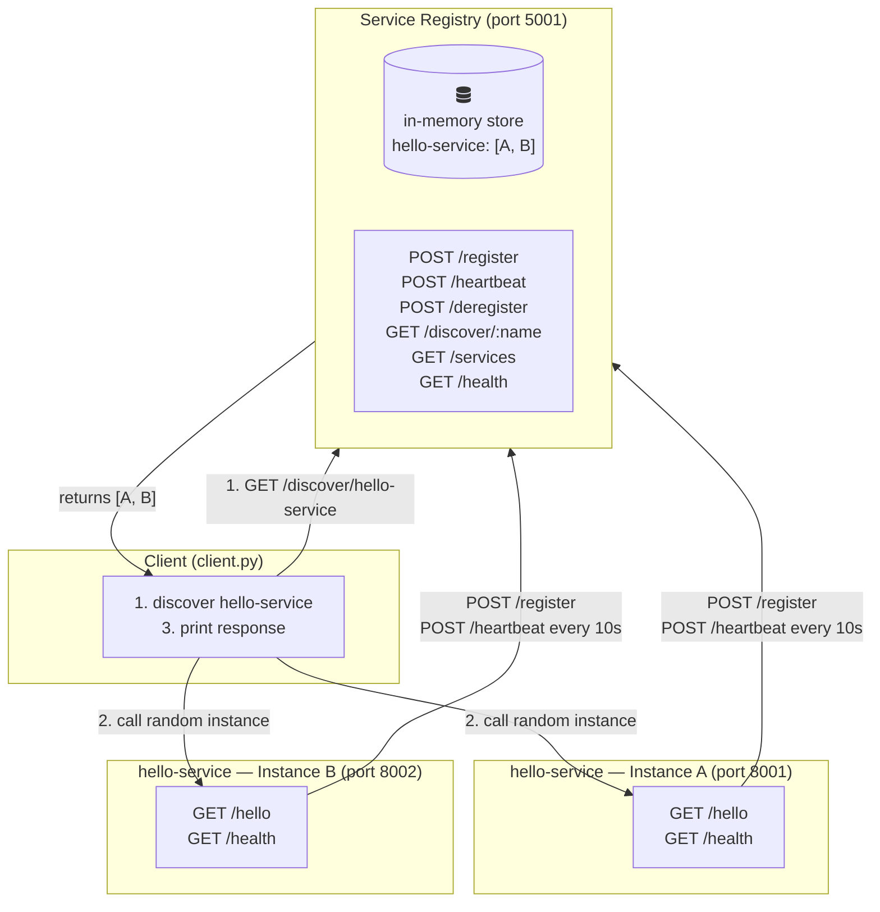
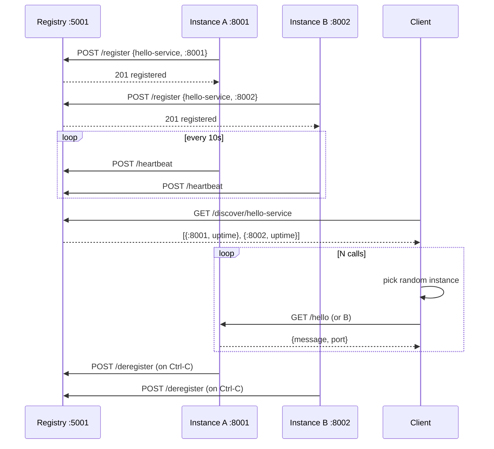

# Architecture

This project implements the **client-side service discovery** pattern:
services register themselves with a central registry, and clients query
the registry to find an available instance before making a call.

## System Diagram

## Sequence Diagram

## Components

| File | Role |
|------|------|
| `service_registry_improved.py` | Central registry — stores service addresses, tracks heartbeats, cleans up stale entries |
| `example_service.py` | Service instance — Flask HTTP server that registers itself and sends heartbeats |
| `client.py` | Discovery client — queries registry, picks a random instance, calls it |

## Flow

1. **Registry starts** on port 5001 and begins a background cleanup thread (removes instances that miss heartbeats for > 30 s).

2. **Two service instances start** (e.g. ports 8001 and 8002). Each instance:
   - `POST /register` → tells the registry its name and address
   - Starts a background thread that `POST /heartbeat` every 10 s
   - Serves `GET /hello` and `GET /health` for incoming requests
   - `POST /deregister` on Ctrl-C before exiting

3. **Client runs** (`python client.py hello-service 5`):
   - `GET /discover/hello-service` → registry returns both instance addresses
   - For each of N calls: picks a random instance, calls `GET /hello`, prints the response
   - Random selection spreads load across instances

## Ports

| Process | Port |
|---------|------|
| Service Registry | 5001 |
| hello-service Instance A | 8001 |
| hello-service Instance B | 8002 |

## Health & Cleanup

- Each instance sends a heartbeat every **10 seconds**.
- The registry removes any instance whose last heartbeat is older than **30 seconds**.
- If an instance is killed without deregistering, it disappears automatically within 30 s.
